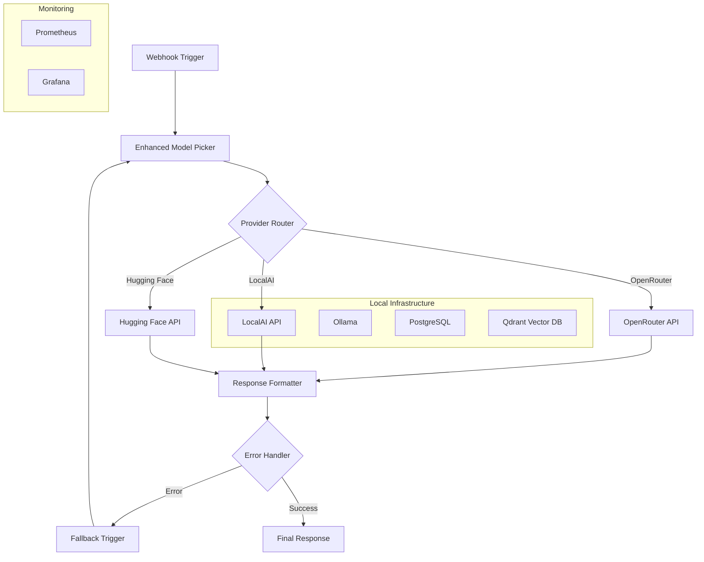

# Lab-Verse AI Orchestration with LocalAI and Hugging Face Integration

[](https://opensource.org/licenses/MIT)
[](https://www.docker.com/)
[](https://n8n.io)

> **Enhanced AI workflow orchestration system combining n8n, LocalAI, and Hugging Face for intelligent model selection and fallback handling**

## 🌟 Overview

This project extends Lab-Verse with a sophisticated AI orchestration system that intelligently routes requests between multiple AI providers:

- **🔄 OpenRouter**: Access to premium models (GPT-4o, Claude, Gemini)
- **🏠 LocalAI**: Self-hosted, privacy-focused local models
- **🤗 Hugging Face**: Open-source models via Inference API
- **🧠 Smart Routing**: Regret-minimization algorithm for optimal model selection
- **🔁 Fallback Logic**: Automatic failover to local models on errors

## 🏗️ Architecture



## ⚡ Quick Start

### Prerequisites

- Docker and Docker Compose
- 4GB+ RAM (8GB+ recommended for local models)
- API keys for OpenRouter and/or Hugging Face

### 1. Clone and Setup

```bash
# Clone the repository
git clone https://github.com/deedk822-lang/The-lab-verse-monitoring-.git
cd The-lab-verse-monitoring-

# Make setup script executable
chmod +x setup-ai-orchestration.sh

# Run setup
./setup-ai-orchestration.sh
```

### 2. Configure Environment

Edit `.env` file with your API keys:

```bash
# Required API Keys
OPENROUTER_API_KEY=your_openrouter_key_here
HUGGINGFACE_API_KEY=your_huggingface_key_here

# Enable local-first mode
USE_LOCAL=true
```

### 3. Start Services

```bash
docker-compose -f docker-compose.ai.yml up -d
```

### 4. Access Points

- **n8n Interface**: http://localhost:5678
- **LocalAI API**: http://localhost:8080
- **Grafana Dashboard**: http://localhost:3000
- **Prometheus Metrics**: http://localhost:9090

## 🤖 Supported Models

### OpenRouter Models
- `openai/gpt-4o` - Premium OpenAI model
- `google/gemini-pro` - Google's advanced model
- `meta/llama-3-70b-instruct` - Meta's large model
- `anthropic/claude-3-sonnet` - Anthropic's reasoning model

### LocalAI Models
- `phi-3` - Microsoft's efficient model
- `llama-3-8b` - Meta's quantized model
- `mistral-7b` - Mistral AI's model
- `codellama-13b` - Code-specialized model

### Hugging Face Models
- `mistral-7b-instruct` - Instruction-tuned Mistral
- `deepseek-coder-6.7b` - Code generation model
- `qwen-14b-chat` - Alibaba's chat model
- `yi-34b-chat` - 01.AI's model

## 📡 API Usage

### Basic Request

```bash
curl -X POST http://localhost:5678/webhook/ai-orchestration \
  -H "Content-Type: application/json" \
  -d '{
    "prompt": "Explain quantum computing in simple terms",
    "preferred_provider": "localai",
    "max_tokens": 500
  }'
```

### Response Format

```json
{
  "response": "Quantum computing is like...",
  "provider": "localai", 
  "model": "phi-3",
  "timestamp": "2025-10-21T02:12:00Z",
  "cost": 0,
  "privacy": "high",
  "processing_time_ms": 1250
}
```

## 🔧 Configuration

### Environment Variables

| Variable | Description | Default |
|----------|-------------|---------|
| `USE_LOCAL` | Prefer local models | `false` |
| `LOCALAI_BASE_URL` | LocalAI endpoint | `http://localai:8080` |
| `OPENROUTER_API_KEY` | OpenRouter API key | Required |
| `HUGGINGFACE_API_KEY` | HuggingFace API key | Required |
| `GPU_LAYERS` | GPU acceleration layers | `0` |

### Model Selection Logic

The system uses a **regret minimization algorithm** that considers:

1. **Cost Efficiency**: Lower cost models get preference
2. **Privacy Level**: Local models rated higher for privacy
3. **Performance History**: Models with better past performance
4. **Availability**: Fallback to available models on failure

### Fallback Strategy

```
OpenRouter (Error) → LocalAI → Hugging Face → Error Response
```

## 🐳 Docker Services

| Service | Port | Purpose |
|---------|------|---------|
| n8n | 5678 | Workflow automation |
| LocalAI | 8080 | Local AI inference |
| PostgreSQL | 5432 | Data persistence |
| Qdrant | 6333 | Vector storage |
| Redis | 6379 | Caching layer |
| Prometheus | 9090 | Metrics collection |
| Grafana | 3000 | Monitoring dashboards |

## 📋 Key Features Added in PR #43

### ✨ Enhanced Model Selection
- **Regret Minimization Algorithm**: Learns from past performance to optimize model selection
- **Cost-Aware Routing**: Factors in API costs when selecting models
- **Privacy Scoring**: Prioritizes local models for sensitive data
- **Performance Tracking**: Maintains historical metrics for each model

### 🔄 Intelligent Fallback System
- **Multi-Provider Support**: OpenRouter → LocalAI → Hugging Face
- **Automatic Error Recovery**: Seamless failover on API errors or rate limits
- **Health Monitoring**: Continuous monitoring of provider availability
- **Context Preservation**: Maintains request context across fallbacks

### 🏠 LocalAI Integration
- **Self-Hosted Models**: Run models locally for maximum privacy
- **GPU Acceleration**: Optional NVIDIA GPU support for faster inference
- **Model Management**: Easy model downloading and configuration
- **OpenAI Compatibility**: Drop-in replacement for OpenAI API calls

### 🤗 Hugging Face Integration
- **Inference API**: Access to thousands of open-source models
- **Custom Models**: Support for fine-tuned and custom models
- **Streaming Support**: Real-time response streaming capabilities
- **Rate Limit Handling**: Intelligent request throttling and queuing

## 📈 Monitoring & Analytics

### Performance Metrics
- **Response Time Tracking**: Monitor latency across all providers
- **Cost Analysis**: Track API usage costs and optimize spending
- **Success Rate Monitoring**: Identify and resolve reliability issues
- **Model Performance**: Compare accuracy and quality metrics

### Grafana Dashboards
- **Real-time Metrics**: Live monitoring of all AI requests
- **Cost Optimization**: Identify cost-saving opportunities
- **Performance Analysis**: Deep dive into model performance
- **Error Tracking**: Monitor and alert on system issues

## 🚀 Getting Started

### 1. Environment Setup

```bash
# Copy environment template
cp .env.ai.example .env

# Edit with your API keys
vim .env
```

### 2. Run Setup Script

```bash
# Make executable and run
chmod +x setup-ai-orchestration.sh
./setup-ai-orchestration.sh
```

### 3. Import Workflow

1. Open n8n at http://localhost:5678
2. Import `n8n/workflows/lab-verse-ai-orchestration.json`
3. Configure credentials for OpenRouter and Hugging Face
4. Test the workflow with sample prompts

### 4. Test the System

```bash
# Test basic functionality
curl -X POST http://localhost:5678/webhook/ai-orchestration \
  -H "Content-Type: application/json" \
  -d '{"prompt": "Hello, world!"}'

# Test local preference
curl -X POST http://localhost:5678/webhook/ai-orchestration \
  -H "Content-Type: application/json" \
  -d '{"prompt": "Generate code", "prefer_local": true}'
```

## 🔒 Security Considerations

- **API Key Management**: Store sensitive keys in environment variables
- **Network Security**: Use firewalls and secure networking
- **Local Data Processing**: Keep sensitive data local with LocalAI
- **Access Control**: Implement authentication and authorization
- **Regular Updates**: Keep all services updated with security patches

## 🤝 Contributing

1. Fork the repository
2. Create feature branch: `git checkout -b feature/ai-enhancement`
3. Commit changes: `git commit -am 'Add AI enhancement'`
4. Push to branch: `git push origin feature/ai-enhancement`
5. Submit pull request

## 📝 Changelog

### v1.1.0 - PR #43 (2025-10-21)
- ✨ Added LocalAI and Hugging Face integration
- 🧠 Implemented regret minimization algorithm
- 🔄 Enhanced fallback logic with intelligent routing
- 📈 Added comprehensive monitoring and metrics
- 🐳 Docker Compose setup with all services
- 📚 Complete documentation and deployment guides

## 💬 Support

- **Issues**: [GitHub Issues](https://github.com/deedk822-lang/The-lab-verse-monitoring-/issues)
- **Discussions**: [GitHub Discussions](https://github.com/deedk822-lang/The-lab-verse-monitoring-/discussions)
- **Documentation**: Check the `/docs` directory for detailed guides

---

**Built with ❤️ for the Lab-Verse community**