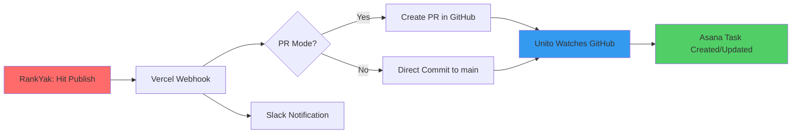

# 🚀 RankYak → GitHub → Unito Bridge
## Production-Ready, Zero-Maintenance Content Sync

[](https://vercel.com/new/clone?repository-url=https://github.com/YOUR-USERNAME/rankyak-github-bridge&env=GITHUB_TOKEN,GITHUB_OWNER,GITHUB_REPO,WEBHOOK_SECRET&project-name=rankyak-bridge)

---

## What This Does

Every time you hit **"Publish"** in RankYak:

1. ✅ Creates/updates a Markdown file in GitHub (`_posts/YYYY-MM-DD-article-slug.md`)
2. ✅ Unito automatically syncs GitHub → Asana (your existing setup keeps working)
3. ✅ Optional: Creates a PR for team review before merging
4. ✅ Sends Slack notification (optional)
5. ✅ One-click rollback via Git

**No n8n, no Make, no Zapier. Just RankYak → GitHub → Unito.**

---

## Quick Start (< 10 Minutes)

### 1. Deploy to Vercel (1 Click)

Click the button above or:

```bash
git clone https://github.com/YOUR-USERNAME/rankyak-github-bridge
cd rankyak-github-bridge
vercel deploy
```

### 2. Configure Environment Variables

In Vercel Dashboard → Settings → Environment Variables:

| Variable | Value | Where to Get It |
|----------|-------|----------------|
| `GITHUB_TOKEN` | `ghp_xxxxxxxxxxxxx` | [GitHub Settings → Developer settings → Personal access tokens](https://github.com/settings/tokens) - Select scope: `repo` |
| `GITHUB_OWNER` | `your-username` | Your GitHub username or org |
| `GITHUB_REPO` | `content` | Repository name (no .git) |
| `GITHUB_BRANCH` | `main` | Branch Unito watches (usually `main`) |
| `WEBHOOK_SECRET` | `rankyak-2025-secure` | Any random string (you'll paste this in RankYak) |
| `CREATE_PR` | `true` | (Optional) Set to `true` for PR mode, `false` for direct commit |
| `SLACK_WEBHOOK_URL` | `https://hooks.slack.com/...` | (Optional) Slack incoming webhook URL |
| `CONTENT_DIR` | `_posts` | (Optional) Directory for content files |

### 3. Get Your Webhook URL

After deployment, Vercel gives you:
```
https://your-project.vercel.app/api/webhook
```

### 4. Configure RankYak

In RankYak:
- Go to **Settings → Integrations → Webhooks**
- Enable webhooks
- **URL:** `https://your-project.vercel.app/api/webhook`
- **Secret:** Same as `WEBHOOK_SECRET` from step 2
- **Events:** Select `post.published` (and optionally `post.updated`)
- Save

### 5. Test It

1. Publish a test article in RankYak
2. Watch Vercel logs (or check GitHub commits)
3. Verify Unito created the Asana task automatically
4. 🎉 Done!

---

## How It Works



### Example Flow

**You publish:** "Best Winter Hiking Gear 2025"

**GitHub gets:**
```markdown
---
title: "Best Winter Hiking Gear 2025"
slug: best-winter-hiking-gear-2025
date: 2025-11-07
author: "Sarah Chen"
tags: [hiking, winter, gear, equipment]
categories: [Outdoor, Gear Reviews]
rankyak_id: 623e1f84a1b2c
status: published
seo_title: "Top 10 Winter Hiking Gear for 2025 | Complete Guide"
seo_description: "Discover the best winter hiking gear..."
featured_image: "https://cdn.rankyak.com/images/winter-gear.jpg"
---

# Best Winter Hiking Gear 2025

Winter hiking requires specialized equipment...

## Essential Gear Checklist
- Insulated boots
- Layered clothing system
...
```

**Unito sees:**
- New commit in `main` (or new PR)
- Creates Asana task: "Review: Best Winter Hiking Gear 2025"
- Assigns to mapped team member
- Links to GitHub commit/PR

**You get:**
- Slack notification: "📝 New content synced from RankYak"
- Asana task ready for editorial review
- Full Git history for rollbacks

---

## Operating Modes

### Mode 1: Direct Commit (Fast Publishing)

**Use when:** You want immediate publication without review.

**Set:** `CREATE_PR=false`

**Result:**
- Content committed directly to `main`
- Unito creates Asana task immediately
- Faster workflow, suitable for solo publishers

### Mode 2: Pull Request (Team Review)

**Use when:** Multiple editors need to review before publishing.

**Set:** `CREATE_PR=true`

**Result:**
- Creates branch: `rankyak/article-id-timestamp`
- Opens PR with full metadata
- Unito creates Asana task linked to PR
- Team reviews, approves, merges
- Unito auto-closes Asana task when PR merges

---

## File Structure Created

```
your-repo/
├── _posts/
│   ├── 2025-11-07-best-winter-hiking-gear.md
│   ├── 2025-11-06-camping-essentials.md
│   └── 2025-11-05-trail-running-tips.md
├── .github/
│   └── workflows/
│       └── unito-sync.yml (your existing Unito config)
└── README.md
```

Each file contains:
- YAML frontmatter with full metadata
- Markdown-converted content from RankYak HTML
- SEO fields for your static site generator
- RankYak ID for bi-directional sync

---

## Rollback & Recovery

### Rollback a Publication

**Option 1: GitHub UI**
1. Go to the commit
2. Click "Revert"
3. Merge the revert PR
4. Unito updates Asana accordingly

**Option 2: Command Line**
```bash
git revert HEAD~1
git push origin main
```

### Re-sync from RankYak

Just re-publish the article in RankYak. The webhook:
- Overwrites the existing file (same slug)
- Updates the Asana task
- Maintains full history in Git

### Bulk Migration

To migrate existing RankYak content:

```bash
# Export from RankYak API
curl https://api.rankyak.com/posts?status=published \
  -H "Authorization: Bearer $RANKYAK_API_KEY" \
  > rankyak_export.json

# Replay through webhook
node scripts/bulk-import.js rankyak_export.json
```

---

## Monitoring & Alerts

### Vercel Logs

View real-time logs:
```bash
vercel logs your-project --follow
```

### Success Indicators

✅ **200 Response:** Webhook processed successfully
✅ **GitHub Commit:** File created/updated
✅ **Unito Sync:** Asana task appears within 30s
✅ **Slack Message:** Notification sent (if configured)

### Error Handling

The webhook automatically handles:
- Duplicate posts (overwrites by slug)
- Missing metadata (uses defaults)
- GitHub API rate limits (retries)
- Invalid HTML (graceful Markdown conversion)

### Alert Setup

Add to your Vercel dashboard:

**Slack Alerts** (already built-in):
- Set `SLACK_WEBHOOK_URL` environment variable
- Get instant notifications on every publish

**Email Alerts:**
- Vercel → Settings → Integrations → Email Notifications
- Enable "Deployment Errors"

**Custom Monitoring:**
```javascript
// Add to webhook.js
await fetch('https://your-monitoring-service.com/ping', {
  method: 'POST',
  body: JSON.stringify({
    service: 'rankyak-bridge',
    status: 'success',
    article: article.title
  })
});
```

---

## Advanced Configuration

### Custom Content Directory

```bash
# Vercel environment variable
CONTENT_DIR=content/blog
```

### Custom Branch Strategy

```bash
# Use different branch for staging
GITHUB_BRANCH=staging

# Unito should watch 'staging' branch
```

### Multi-Site Support

Deploy multiple instances:
```bash
# Production
vercel --prod --env GITHUB_REPO=blog-prod

# Staging
vercel --env GITHUB_REPO=blog-staging
```

### Metadata Customization

Edit `createMarkdownContent()` in `api/webhook.js`:

```javascript
const frontmatter = {
  title: article.title,
  slug: article.slug || generateSlug(article.title),
  // Add custom fields
  wordpress_id: article.custom_fields?.wordpress_id,
  editorial_status: 'needs_review',
  publish_date: article.scheduled_at || article.published_at,
  // ... your fields
};
```

---

## Integration with Existing Unito Setup

### Your Current Unito Flow (Unchanged)

```
GitHub (main branch) ↔ Asana (Editorial Project)
```

**Unito Rules:**
- New commit → Create Asana task
- Commit author → Asana assignee
- Commit message → Task description
- PR merged → Close task

### This Bridge Adds

```
RankYak → Vercel → GitHub (commits) → [Unito keeps working] → Asana
```

**No Unito changes needed!** The bridge just:
- Converts RankYak content to GitHub-friendly Markdown
- Commits with proper formatting
- Lets Unito do its existing job

---

## Cost & Performance

### Vercel Free Tier

✅ **100GB bandwidth/month** (plenty for webhooks)
✅ **100 hours compute/month** (webhooks use ~1 second each)
✅ **Unlimited API calls**

**Typical usage:** 100 articles/month = <1% of free tier

### GitHub API Limits

✅ **5,000 requests/hour** (with PAT)
✅ **1 commit per webhook** = 5,000 articles/hour capacity

### Unito Limits

✅ **Uses existing Unito plan**
✅ **No additional sync tasks** (same as manual commits)

---

## Security Best Practices

### Webhook Security

✅ **HMAC signature verification** (SHA-256)
✅ **Secret validation** on every request
✅ **HTTPS-only** (Vercel enforces)

### GitHub Token Security

✅ **Minimal scope:** Only `repo` access
✅ **Stored as environment variable** (encrypted)
✅ **Rotate regularly** (recommended: every 90 days)

### Production Checklist

- [ ] Use strong `WEBHOOK_SECRET` (20+ random characters)
- [ ] Enable Vercel's "Environment Variable Protection"
- [ ] Restrict GitHub token to specific repository
- [ ] Enable Vercel's "IP Allowlist" (if RankYak provides static IPs)
- [ ] Set up Vercel's "Secure Headers"
- [ ] Enable GitHub's branch protection rules
- [ ] Review Vercel logs weekly

---

## Troubleshooting

### Webhook Not Firing

**Check:**
1. RankYak webhook configuration (URL, secret)
2. Vercel deployment status (active?)
3. Vercel logs for incoming requests

**Test manually:**
```bash
curl -X POST https://your-project.vercel.app/api/webhook \
  -H "Content-Type: application/json" \
  -H "X-Webhook-Signature: sha256=test" \
  -d '{
    "event": "post.published",
    "article": {
      "id": "test123",
      "title": "Test Article",
      "content": "<p>Test content</p>"
    }
  }'
```

### GitHub Commits Not Appearing

**Check:**
1. GitHub token validity (refresh if expired)
2. Repository permissions (token has `repo` scope?)
3. Branch exists (create `main` if missing)

**Verify token:**
```bash
curl -H "Authorization: Bearer $GITHUB_TOKEN" \
  https://api.github.com/user
```

### Unito Not Syncing

**Check:**
1. Unito flow is active
2. Watching correct branch (`main`)
3. File path matches Unito filters
4. Unito sync logs in Asana

**Unito requires:**
- Commits to watched branch
- File changes in watched directory
- Proper Git author email

### Markdown Conversion Issues

**If content looks weird:**

Edit `htmlToMarkdown()` function in `api/webhook.js`:

```javascript
// Add custom conversions
.replace(/<your-custom-tag[^>]*>(.*?)<\/your-custom-tag>/gi, 'YOUR MARKDOWN')
```

---

## Extending the Bridge

### Add WordPress Publishing

```javascript
// In api/webhook.js, after GitHub commit

// Publish to WordPress
const wpResponse = await fetch(`https://yoursite.wordpress.com/wp-json/wp/v2/posts`, {
  method: 'POST',
  headers: {
    'Authorization': `Basic ${Buffer.from(`${process.env.WP_USER}:${process.env.WP_PASSWORD}`).toString('base64')}`,
    'Content-Type': 'application/json'
  },
  body: JSON.stringify({
    title: article.title,
    content: content,
    status: 'publish'
  })
});
```

### Add Bria AI Images

```javascript
// Before GitHub commit, generate featured image

if (!article.featured_image_url) {
  const briaResponse = await fetch('https://api.bria.ai/v1/images/generate', {
    method: 'POST',
    headers: {
      'Authorization': `Bearer ${process.env.BRIA_AI_API_KEY}`
    },
    body: JSON.stringify({
      prompt: `Professional featured image for: ${article.title}`,
      style: 'photorealistic'
    })
  });

  const imageData = await briaResponse.json();
  article.featured_image_url = imageData.url;
}
```

### Add Analytics

```javascript
// Track publish metrics

await fetch('https://your-analytics.com/event', {
  method: 'POST',
  body: JSON.stringify({
    event: 'article_published',
    properties: {
      title: article.title,
      author: article.author?.name,
      tags: article.tags,
      timestamp: new Date().toISOString()
    }
  })
});
```

---

## Migration from n8n/Make/Zapier

### Before (Complex)

```
RankYak → n8n/Make → LocalAI → Bria AI → GitHub → WordPress → Asana
```

**Problems:**
- Multiple failure points
- Complex debugging
- Webhook chaining delays
- Monthly automation costs

### After (Simple)

```
RankYak → Vercel → GitHub → [Unito] → Asana
```

**Benefits:**
✅ Single webhook endpoint
✅ No automation platform fees
✅ Faster (no intermediary hops)
✅ Git-based rollback
✅ Unito keeps working as-is

### Migration Steps

1. **Deploy this bridge** (10 minutes)
2. **Test with 1 article** (confirm GitHub + Asana sync)
3. **Disable n8n/Make/Zapier workflows** (pause, don't delete yet)
4. **Monitor for 1 week** (ensure no issues)
5. **Delete old automations** (once confident)

---

## FAQ

### Q: What happens if RankYak sends duplicate webhooks?

**A:** The bridge is idempotent. Same slug = overwrites existing file with updated content. Git maintains full history.

### Q: Can I use this with multiple RankYak accounts?

**A:** Yes. Deploy separate Vercel instances with different `GITHUB_REPO` values, or use `CONTENT_DIR` to separate content:
```
CONTENT_DIR=_posts/account1  # First account
CONTENT_DIR=_posts/account2  # Second account
```

### Q: Does this work with GitHub Enterprise?

**A:** Yes. Set `GITHUB_API_URL` environment variable:
```bash
GITHUB_API_URL=https://github.your-company.com/api/v3
```

### Q: What if Unito is down?

**A:** Content still commits to GitHub. Unito syncs retroactively when it recovers. No data loss.

### Q: Can I customize the PR template?

**A:** Yes. Edit the `prBody` variable in `createPullRequest()` function.

### Q: What about images in the article content?

**A:** Images remain as URLs in Markdown. If you need to download and upload to your CDN, add custom logic:

```javascript
// Find all image URLs
const images = content.match(/!\[.*?\]\((.*?)\)/g);

// Download and upload each
for (const img of images) {
  const url = img.match(/\((.*?)\)/)[1];
  // Your upload logic here
}
```

---

## Support & Contributing

### Documentation
- [RankYak API Docs](https://docs.rankyak.com)
- [GitHub API Reference](https://docs.github.com/en/rest)
- [Unito Help Center](https://support.unito.io)
- [Vercel Documentation](https://vercel.com/docs)

### Repository
- **GitHub:** [rankyak-github-bridge](https://github.com/YOUR-USERNAME/rankyak-github-bridge)
- **Issues:** Report bugs and request features
- **Pull Requests:** Contributions welcome!

### Quick Links
- [Deploy to Vercel](#quick-start)
- [Configure Webhook](#4-configure-rankyak)
- [View Logs](https://vercel.com/dashboard)
- [Manage Unito](https://app.unito.io)

---

## License

MIT License - Use freely in commercial and personal projects.

---

**Built for Lab-Verse by the community • Last updated: 2025-11-07**