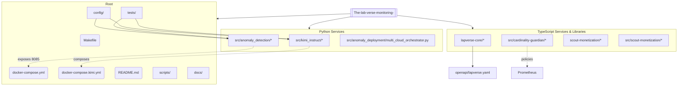

# LabVerse Monitoring & AI Project Manager — Comprehensive Architecture

## Runtime Architecture
```mermaid
flowchart LR
    %% Networks
    subgraph Public_Network [Public Network]
      Traefik{{Traefik Reverse Proxy}}
    end

    subgraph Monitoring_Network [Monitoring Network]
      Prometheus[(Prometheus)]
      Grafana[(Grafana)]
      Alertmanager[(Alertmanager)]
      NodeExporter[(Node Exporter)]
      Kimi[Kimi Instruct (AI PM)]
      Anomaly[Anomaly Detection Service]
      Cardinality[Cardinality Guardian]
    end

    subgraph Backend_Network [Backend Network]
      Postgres[(PostgreSQL)]
      Redis[(Redis)]
      RabbitMQ[(RabbitMQ)]
      Web[Web/API Service]
      Worker[Background Worker]
    end

    %% Traffic flow
    Traefik --- Web
    Traefik -.-> Kimi

    %% App <-> Backend
    Web <-->|DB| Postgres
    Web <-->|Cache| Redis
    Web <-->|Queue| RabbitMQ
    Worker --> RabbitMQ

    %% Monitoring
    Prometheus --> Grafana
    Prometheus --> Alertmanager
    Prometheus -->|scrape| Web
    Prometheus -->|scrape| Worker
    Prometheus -->|scrape| Kimi
    Prometheus -->|scrape| Anomaly
    Prometheus -->|scrape| Cardinality
    Prometheus -->|scrape| NodeExporter

    %% AI PM integrations
    Kimi -->|manages| Prometheus
    Kimi -->|manages| Grafana
    Kimi -->|alerts| Alertmanager
    Kimi -->|orchestrates| Web
    Kimi -->|orchestrates| Worker

    %% ML/Resilience services
    Anomaly -->|alerts| Alertmanager
    Cardinality -->|policies| Prometheus
```

## Repository Map (Monorepo)


### Notes
- Runtime diagram derived from `docker-compose.yml` and `docker-compose.kimi.yml` plus Makefile targets.
- Repo map shows major modules, not every file. Both `scout-monetization/` (root) and `src/scout-monetization/` exist and are shown.
- `lapverse-core/openapi/lapverse.yaml` documents core API contracts; `Cardinality Guardian` enforces metrics hygiene for Prometheus.
- Tests focus on Kimi integration and anomaly detection service.
